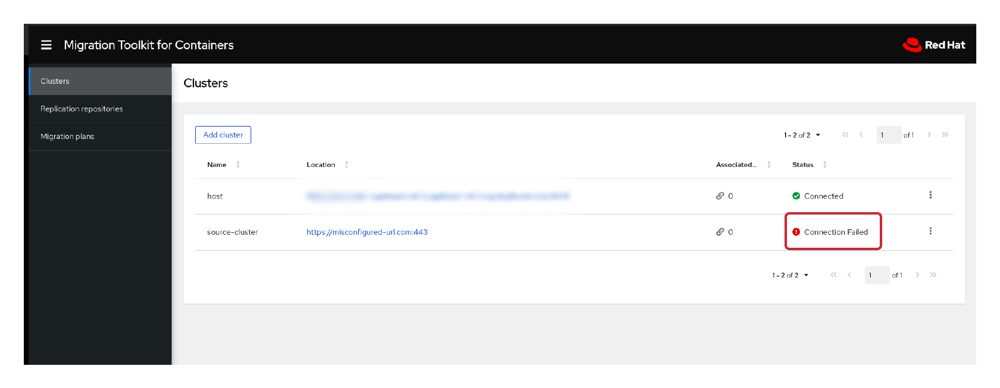
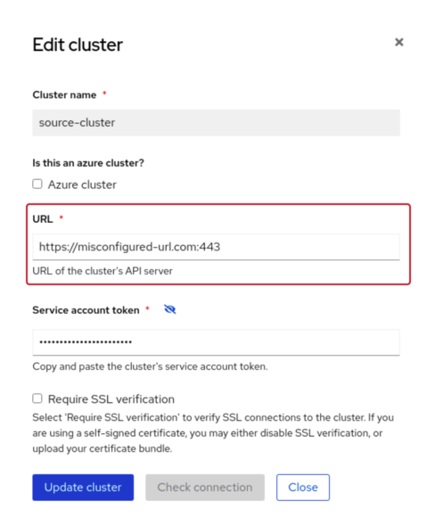

# Exercise 1 : Misconfiguration

This exercise helps users create misconfigured MTC custom resources. The users are expected to fix the misconfigured resources to drive a successful migration.

## Create CRs

Login to your destination cluster and create the CRs using:

```sh
oc apply -f 01-misconfig.yml
```

This will create MigCluster and MigStorage resources that are intentionally misconfigured. 

### Fix

#### Fix MigCluster

The `MigCluster` resource we just created in the previous step can be found in the MTC UI under `Clusters` tab as shown below:



The cluster named `source-cluster` has status `Connection Failed` reported on it. There are number of reasons why this can be caused:

1. Wrong URL to the source cluster

Use the dropdown menu to find the _Edit_ option for the cluster. When clicked, it will open a modal which displays the information about the Cluster. Notice that the _URL_ field has a wrong URL:



Copy the right URL of your source cluster in this field.

2. Wrong Service Account Token

In the same modal, find the _Service account token_ field:


The field contains a wrong SA token. To get the service account token for your source cluster, login to your source cluster and run:

```yml
oc sa get-token migration-controller -n openshift-migration
```

The above command will print the SA token in your terminal window, copy it and paste it in the field shown above. 

Now click the `Update cluster` button on the opened modal to save the new values:


The Cluster resource now should show `Connected` in the _Status_ field:


#### Fix MigStorage

Use MTC UI to find Replication Repository named `s3-repository`. Use the right bucket name and the AWS access keys to fix the repository.
