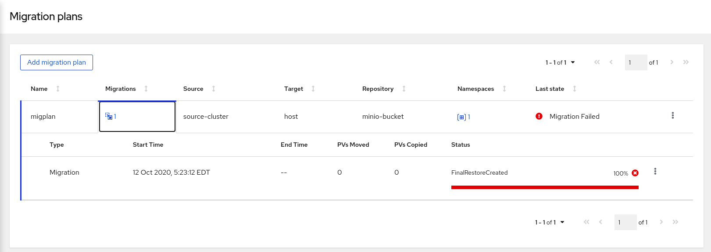

# Exercise 2 : GVK Incompatibility

This exercise guides users through a failed migration scenario due to incompatible GVKs between the source and the destination cluster. It helps users identify the problem on their own by investigating different migration resources.

## Prepare 

To perform this exercise, we will install a new Custom Resource Definition on the source and the destination cluster. The version of the CRD on the destination cluster will be different from that of the source cluster. 

Login to your source cluster and deploy the Custom Resource Definition and an instance of the Custom Resource:

```sh
oc apply -f 02-source-manifest.yaml
```

This will create a namespace `gvk-demo` on your source cluster and deploy an instance of Custom Resource in it.

Login to your destination cluster and deploy the Custom Resource Definition:

```sh
oc apply -f 02-dest-manifest.yaml
```


## Migrate GVK incompatible namespace

On your destination cluster, create a new MigPlan to migrate namespace `gvk-demo`. 


Run a migration by clicking _Migrate_ option from the dropdown menu on the migplan.

The migration will fail at _FinalRestoreCreated_ phase:



## Investigate

For each migration, MTC creates a _MigMigration_ Custom Resource. We will investigate the resource to find out the cause of the issue. 

Login to the destination cluster and find the _MigMigration_ resource associated with the _MigPlan_ you created:

```sh
oc get migmigration -n openshift-migration -l migration.openshift.io/migplan-name=<migplan_name>
```

Replace `<migplan_name>` with the name of _MigPlan_ you created.

```sh
[pranav@dragonfly mig-controller]$ oc get migmigration -n openshift-migration -l migration.openshift.io/migplan-name=migplan
NAME                                   READY   PLAN      STAGE   ITINERARY   PHASE       AGE
218bcb80-0cd1-11eb-bd4f-875ce826b7be           migplan   false   Failed      Completed   35m
```

Copy the name of the _MigMigration_ and run `oc get` to read the yaml definition:

```sh
[pranav@dragonfly mig-controller]$ oc get migmigration -n openshift-migration 218bcb80-0cd1-11eb-bd4f-875ce826b7be -o yaml
apiVersion: migration.openshift.io/v1alpha1
kind: MigMigration
metadata:
  annotations:
    openshift.io/touch: 8fd15f40-0cd1-11eb-929a-0a580a83002f
  creationTimestamp: "2020-10-12T21:23:11Z"
  generation: 27
  labels:
    migration.openshift.io/migplan-name: migplan
  name: 218bcb80-0cd1-11eb-bd4f-875ce826b7be
  namespace: openshift-migration
  ownerReferences:
  - apiVersion: migration.openshift.io/v1alpha1
    kind: MigPlan
    name: migplan
    uid: 3b811cb7-d2df-407f-a268-c8af308961aa
  resourceVersion: "1957021"
  selfLink: /apis/migration.openshift.io/v1alpha1/namespaces/openshift-migration/migmigrations/218bcb80-0cd1-11eb-bd4f-875ce826b7be
  uid: 194c16d2-5216-4b49-a75b-f0b0a41f0a61
spec:
  migPlanRef:
    name: migplan
    namespace: openshift-migration
  stage: false
status:
  conditions:
  - category: Advisory
    durable: true
    lastTransitionTime: "2020-10-12T21:26:13Z"
    message: 'The migration has failed.  See: Errors.'
    reason: FinalRestoreCreated
    status: "True"
    type: Failed
  errors:
  - 'Restore: openshift-migration/218bcb80-0cd1-11eb-bd4f-875ce826b7be-nxpkb partially
    failed.'
  itinerary: Failed
  observedDigest: 9834d071975562d5e2c2eb855bca6950711ded8a0e45af5307fa56cd0f5ba3c7
  phase: Completed
  startTimestamp: "2020-10-12T21:23:12Z"
```

Examine the `status` in the yaml output of _MigMigration_. In the above case, the error message indicates that the Velero Restore `218bcb80-0cd1-11eb-bd4f-875ce826b7be-nxpkb` partially failed. 


We will now locate the tarball associated with this restore in the _Replication Repository_ and download the archive. 

Login to the minio UI, and find the bucket you created in the previous exercise. Within the bucket, find the directory associated with the restore by navigating through `velero -> restores -> <your_restore_directory>`. The restore directory is named after the name of the Velero Restore mentioned in _MigMigration_.


Download the `restore-<restore_name>-results.gz` archive. Extract the archive to find a file which contains useful information about the partially failed restore. This file contains list of warnings and errors in a JSON format. We are interested in knowing the errors:

```json
{"errors":{"namespaces":{"gvk-demo":["error restoring gvkdemoes.konveyor.openshift.io/gvk-demo/gvk-demo: the server could not find the requested resource"]}}}
```

From the error message above, it is clear that Velero failed to restore the Custom Resource `gvkdemoes.konveyor.openshift.io` we created. 


